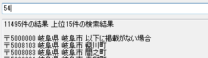
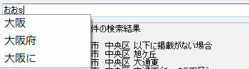

# 宿題 - 郵便番号検索

## 概要

- 郵便番号から住所を検索できるC#のソフトを作る
- 期日：2015年9月9日(水) 23:59:59 (JST)
- Slack又はメールでコードを提出
- データは以下の郵便局のデータを使用
    - サイズが大きいのでメモ帳などで開くと重い

[郵便番号データダウンロード 住所の郵便番号（ローマ字） zip形式 - 日本郵便](http://www.post.japanpost.jp/zipcode/dl/roman-zip.html)

## 採点基準

そんなに堅苦しいものじゃないけど、以下のことに気をつけて作って欲しいです。提出後に色々ケチ付けるんで、それの主な内容です。

- 分かりやすいコードか
    - チームでこれから開発を行います。みんなが分かりやすいようにコーディングしましょう。
    - 必要に応じてコメントを入れる
    - ローマ字の変数名は使わない
    - インデントは綺麗にする
- 速度が早く快適か　以下が基準です
    - ファイルの読み込みに1秒以下
    - 検索に0.5秒以下
- 使い方が分かりやすいか
    - 無駄にボタンが10個あるとかやめてください

## その他

技術的なこと

- 今回できるだけ「配列」を使わないでください
    - 代わりにListを使いましょう
- 郵便番号のファイルの文字コードはShiftJISです
- Visual Studio 2015もしくは2013を使用してください
- UIは指定しないので、自由に作ってください

それ以外

- 悩んだら気軽にSlackとかで聞いてください(調べる努力はしてね)
- 期日は相談次第で伸ばします
- コードは後で晒します

## 追加要件

簡単だと思ったら以下のことを追加してやって欲しいです

- 入力途中でもリアルタイムに検索結果を表示する
- 住所から郵便番号の検索にも対応する
- スペース区切りで住所の検索ワードを増やせる(割りと難しいと思う)
    - 例えば「大阪　日本橋」と入力すると4件ヒットする

