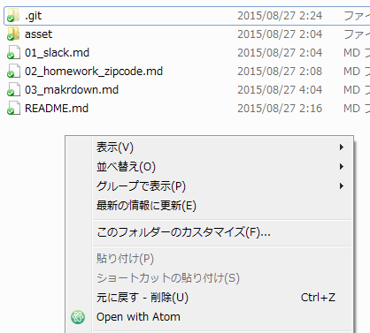

# Markdwonの紹介

HTMLがマークアップ言語と呼ばれる逆でマークダウンです。
プログラマーがドキュメントを書くときによく使います。
この資料もMarkdownで書かれています。
MarkdownはHTMLに変換可能です。

 |HTML|Markdown
---|---|---
自由度|高い|そこそこ
書き方|ゴテゴテしてる|単純
書く速度|記号とかばかりで遅い|記号少なくて早い


## Atom

Githubが作っているAtomというエディターが有ります。
Markdownに対応しています。
他の機能は一般のエディタ+αって感じなので、使ってみて慣れてみましょう。
https://atom.io/

### フォルダを開く

[File]メニューの[Open Folder]をクリックしてフォルダごと開いたりできます。
またエクスプローラーでフォルダを開き、
右クリックすると[Open With Atom]というメニューが表示されます。
そのメニューから開くこともできます。



### ファイル作成

Atomでフォルダを開いた後、左に表示されたファイル一覧を右クリックすると
[New File]などのメニューが表示されます。
[New File]をクリックするとファイル名を入力する画面になります。

試しに「test.md」と入力しましょう。
Markdownファイルの拡張子は.mdです。

### 書いてみる

実際に下に書いている記法に従ってMarkdwonを書いてみましょう！
色付けされて分かりやすいです。

### プレビュー

[Ctrl ＋Shift + M]キーを押すとプレビューすることができます。


### フォント

標準では見難いフォントだったりするので、日本語に適した設定にします。

[File]メニューの[Settings]を開き、
中程にある[Font Family]に[Meiryo]を入力します。

`C:\Users\ユーザ名\.atom\styles.less`のファイルを開き、以下を最後に追記する。

```
.tree-view { font-family: "Meiryo"; }
.markdown-preview { font-family: "Meiryo"; h1, h2, h3, h4, h5, h6 { font-family: "Meiryo"; } }
```


## 簡単なMarkdwon記法

### 見出し

HTMLのh1,h2,h3タグなどの見出しは以下のようにします。
シャープと見出しの名前の間の半角スペースが重要です。

```
# h1見出し
## h2見出し
### h3見出し
```

### 段落

改行などは基本的に反映されないです。
空の行があるとpタグが変わる感じです。

```
段落1
改行されずに段落2

段落2
```

### リスト

ulとolリストは以下のようにします。

```
- リスト1
- リスト2
- リスト3

1. 順序付きリスト1
2. 順序付きリスト2
3. 順序付きリスト3
```

### リンク

aタグなどのリンクは以下のようにします。

```
http://github.com/  ←URLは自動リンクされます
[title](http://github.com/)  ←テキストを変更
```


### コード

```
バッククォート3つでこんな風に囲まれます。
複数行のコードなどを書きます。
```

1つのバッククォートで囲むと`こんな感じに`なります。

### テーブル

Tableタグって面倒ですよね。

```
名前|読み|声|年齢
---|---|---|---
伊丹 耀司|いたみ ようじ|諏訪部順一|33
栗林 志乃|くりばやし しの|内田真礼|24
テュカ・ルナ・マルソー||金元寿子|165
レレイ・ラ・レレーナ||東山奈央|15
ロゥリィ・マーキュリー||種田梨沙|961
```

こう書くと以下のようになります。簡単！

名前|読み|声|年齢
---|---|---|---
伊丹 耀司|いたみ ようじ|諏訪部順一|33
栗林 志乃|くりばやし しの|内田真礼|24
テュカ・ルナ・マルソー||金元寿子|165
レレイ・ラ・レレーナ||東山奈央|15
ロゥリィ・マーキュリー||種田梨沙|961


## 最後に

他にも、太字や画像の挿入などもできます。
覚えると大変書きやすいので、使えるようになりましょう。
